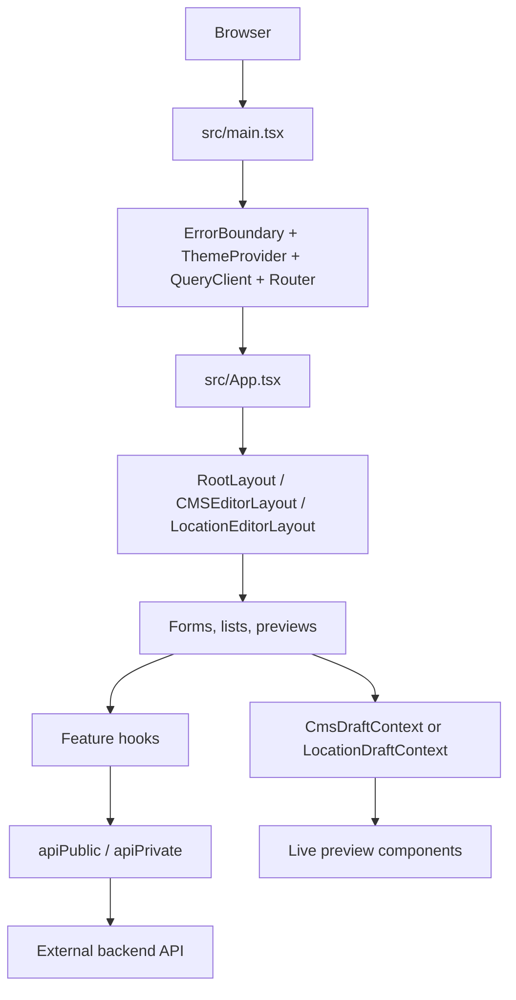

# CODEBASE OVERVIEW

## 1. Project Summary

This repository is a React/TypeScript/Vite administration dashboard for the MIRA product.

The current implementation provides:

- Authentication and protected dashboard access
- CMS page listing and editing
- Live CMS draft previews
- Home, Navbar, Footer, FAQ, Contact, and CTA editors
- Location management and location preview editing
- User, role, permission, request, instructor, beach-page, and dashboard-statistics API hooks
- Image, video, and generic file uploads
- SEO metadata editing
- Dynamic styled form controls
- Universal image/video/color form and preview components

The repository is a frontend dashboard. Backend implementation, database schema, payment processing, booking services, and server infrastructure are not present in this repository.

Primary entrypoints:

- Application startup: `src/main.tsx`
- Route tree: `src/App.tsx`
- API clients: `src/lib/api-client.ts`
- CMS editor shell: `src/components/layout/CMSEditorLayout.tsx`
- Location editor shell: `src/components/pages/Location/LocationEditorLayout.tsx`

## 2. Technology Stack

| Area | Technology | Purpose |
|---|---|---|
| Frontend | React 19 | UI rendering |
| Language | TypeScript 6 | Static typing |
| Build | Vite 8 | Development server and production build |
| Routing | React Router DOM 7 | Client-side routes |
| Server state | TanStack React Query 5 | API queries, mutations, cache invalidation |
| HTTP | Axios | Public/private API clients |
| Styling | Tailwind CSS 4 | Utility styling |
| UI primitives | Radix/shadcn-style components | Inputs, dialogs, select, labels, buttons |
| Icons | Lucide React | UI icons |
| Animation | Framer Motion | Animation components |
| Maps | MapLibre GL | Location map editing and preview |
| Notifications | Sonner | Toast feedback |
| Uploads | Multipart `/file-upload` API | Image, video, and generic file upload |
| Deployment | GitHub Actions + SSH/Hostinger; Vercel config also exists | Deployment paths in repository |
| Database | Unknown / Not found in this repository | Backend-owned |
| ORM | Unknown / Not found in this repository | Backend-owned |
| Cache | Unknown / Not found in this repository | No Redis client/config found |
| Payments | Unknown / Not found in this repository | No payment gateway code found |

Package scripts are defined in `package.json`:

```text
npm run dev
npm run build
npm run lint
npm run typecheck
npm run format
npm run preview
```

## 3. High-Level Architecture



The frontend owns UI state, draft editing, request orchestration, and preview rendering. The API server owns persistence, backend validation, database operations, authentication verification, and storage behavior.

## 4. Repository Structure

```text
.
├── src/
│   ├── main.tsx
│   ├── App.tsx
│   ├── index.css
│   ├── assets/
│   ├── components/
│   │   ├── auth/
│   │   ├── layout/
│   │   ├── pages/
│   │   ├── shared/
│   │   └── ui/
│   ├── config/
│   ├── hooks/
│   ├── lib/
│   └── services/
├── public/
├── docs/
├── .github/workflows/deploy.yml
├── package.json
├── vite.config.ts
├── tsconfig*.json
├── vercel.json
└── documentation and planning markdown files
```

### Important folders

- `src/components/auth`: Public/private route guards and authentication UI.
- `src/components/layout`: Root dashboard layout, sidebar, CMS editor layout, and logout UI.
- `src/components/pages/CMS`: CMS forms, section registries, previews, shared CMS controls, and draft handling.
- `src/components/pages/Location`: Location editor, location section registry, forms, previews, map controls, and location draft handling.
- `src/components/shared`: Cross-feature upload, preview, scaling, and reusable visual components.
- `src/components/ui`: Base UI primitives such as input, textarea, select, dialog, label, and tooltip.
- `src/hooks`: API-facing React Query hooks grouped by feature.
- `src/lib`: Axios clients, API error normalization, and utility helpers.
- `src/services`: Lower-level services such as generic file upload.
- `docs`: CMS flow and architecture notes, especially Home and Footer documentation.

## 5. Application Startup

`src/main.tsx` creates the application tree in this order:

1. React `StrictMode`
2. `ErrorBoundary`
3. `ThemeProvider`
4. `QueryClientProvider`
5. `BrowserRouter`
6. `App`
7. Sonner `Toaster`

The React Query client is created at module scope. Feature hooks use TanStack Query for request state and invalidation.

The `@/*` import alias maps to `src/*` through `tsconfig.app.json` and `vite.config.ts`.

## 6. Routing

Routes are defined in `src/App.tsx`.

### Public

- `/login`

### Protected dashboard routes

- `/`
- `/user`
- `/requests`
- `/privacy-policy`
- `/terms-of-service`
- `/cms`
- `/location`

### CMS editor

- `/cms/:slug`

The CMS list encodes links as:

```text
/cms/<slug>&&<pageId>
```

`CMSEditorLayout` splits the parameter at `&&` and selects the editor preview by slug.

### Location editor

- `/locations/new`
- `/locations/:id/:slug`

### Route guards/layouts

- `PublicRoute`: prevents authenticated users from returning to public auth pages.
- `PrivateRoute`: verifies access token and current user before rendering protected content.
- `RootLayout`: dashboard shell.
- `CMSEditorLayout`: split editor/live-preview shell.
- `LocationEditorLayout`: location editor/live-preview shell.

A wildcard route renders `NotFoundPage`.

Several legacy routes and a standalone preview route remain commented out in `App.tsx`.

## 7. API Client and Request Flow

API clients are in `src/lib/api-client.ts`:

- `apiPublic`: unauthenticated requests
- `apiPrivate`: requests with bearer authentication

Base URL resolution:

```ts
import.meta.env.VITE_API_URL || "https://api.get-surf.com/api/v1"
```

The checked-in `.env` points to `https://backend.get-surf.com/api/v1`; `.env.example` points to a localhost API. This is configuration drift and should be resolved deliberately, not silently.

Private requests:

1. Read `accessToken` from `localStorage`.
2. Add `Authorization: Bearer <token>`.
3. Send JSON or multipart request.
4. Normalize errors through `src/lib/api-error.ts`.
5. Show global Sonner errors for failed requests.
6. On 401, remove the access token and dispatch an `unauthorized` browser event.

No frontend refresh-token implementation was found.

## 8. Authentication and Authorization

Relevant files:

- `src/components/auth/PrivateRoute.tsx`
- `src/components/auth/PublicRoute.tsx`
- `src/hooks/auth/useLogin.ts`
- `src/hooks/auth/useMe.ts`
- `src/components/pages/Auth/SignIn.tsx`
- `src/components/layout/LogoutModal.tsx`

Login flow:

```text
SignIn
  -> POST /auth/login
  -> store accessToken and refreshToken in localStorage
  -> clear React Query cache
  -> navigate to /
```

Private route flow:

```text
accessToken exists?
  -> GET /auth/user-info
  -> show loading while checking
  -> render protected layout or redirect to /login
```

Logout removes both tokens, clears the query cache, shows a toast, and navigates to `/login`.

Server-side roles and permissions are accessed through hooks under `src/hooks/role` and `src/hooks/permission`. Full backend authorization rules are Unknown / Not found in this repository.

## 9. CMS Architecture

CMS page configuration is in `src/config/cms.ts`. Current configured pages include:

- Home
- Navbar
- Footer
- FAQ
- Contact Us
- CTA

CMS form pages are selected by `src/components/pages/CMS/PageSections.tsx`.

CMS preview pages are selected by `src/components/layout/CMSEditorLayout.tsx`.

### CMS GET flow

Reusable CMS editors use `src/components/pages/CMS/shared/useCmsPage.ts`:

```text
useCmsPage(slug, name)
  -> useGetCmsBySlug(slug)
  -> GET /cms-pages?slug=<slug>
  -> local page state
  -> useSetCmsDraft(page)
  -> CmsDraftContext
  -> live preview reads useCmsDraft()
```

### CMS draft flow

`src/components/pages/CMS/shared/CmsDraftContext.tsx` stores the in-memory page draft. It does not persist drafts independently.

```text
Form event
  -> setPage()
  -> useCmsPage effect
  -> setDraft(page)
  -> sibling preview rerenders
```

### CMS save flow

`useCmsPage.save()`:

- Copies `page.data` to the payload.
- Removes nested `data.metadata` if present.
- Sends page metadata as top-level `metadata`.
- Normalizes `robots.index` and `robots.follow` defaults to `true`.
- Uses existing CMS `id` for update.
- Sends `POST /cms-pages` for both create and update paths.

Mutation implementation: `src/hooks/cms/useAddCms.ts`.

### CMS preview flow

`CMSEditorLayout` wraps editor and preview with `CmsDraftProvider`. Current preview registrations:

- Home: `HomePreview`
- Navbar: `NavbarPreview`
- Footer: `FooterPreview`
- FAQ: `FaqPreviewShell`
- Contact: `ContactPreviewShell`
- CTA: `CtaPreview`

## 10. Reusable CMS Form Patterns

### DynamicStyledField

Defined in `src/components/pages/CMS/shared/FormControls.tsx`.

Supports:

- text
- textarea
- number
- color
- select
- switch
- image
- video
- field validation
- text/background styling through `enableStyle`, `style`, and `onStyleChange`

### UniversalMultimediaForm

Defined in `src/components/pages/CMS/shared/UniversalMultimediaForm.tsx`.

Use it for every image/video/color surface instead of creating a new media form. It supports:

- Image
- Video
- Color
- Type dropdown
- Alt text
- Opacity
- Overlay color/opacity
- Autoplay/loop/muted
- Separate controlled media keys

### UniversalMultimediaPreview

Defined in `src/components/pages/CMS/Home/shared/preview/UniversalMultimediaPreview.tsx`.

It consumes the same media object created by `UniversalMultimediaForm`, including nested `imageData` and `videoData`.

### SeoForm

Defined in `src/components/pages/CMS/shared/SeoForm.tsx`. Home, Navbar, Footer, FAQ, Location, and CTA integrations use or adapt this shared form.

### ButtonsField

Defined in `src/components/pages/CMS/shared/ButtonsField.tsx`. Home Hero and CTA-style forms use it for reusable button editing.

### FormBuilder

Located in `src/components/pages/CMS/shared/formBuilder`.

It provides reusable dynamic inquiry fields:

- Text/email/textarea
- Checkbox
- Radio
- Select dropdown
- Custom field name
- Required setting
- Required error message
- Regex
- Custom error message
- Field icon/file
- Field box background color
- Placeholder styling
- Image/video/file media configuration
- Allowed extensions
- Add/delete options

`FormBuilderPreview.tsx` and `PreviewField.tsx` render the same field configuration in live preview.

## 11. CMS Page-by-Page Architecture

### Home

Registry: `src/components/pages/CMS/Home/config/homeSections.ts`

Sections:

- Hero
- Explore Journeys
- Destinations
- Mira Stories
- Why Mira
- Travel Insights
- Custom Journey CTA

Forms use `DynamicStyledField`, `UniversalMultimediaForm`, and `ButtonsField`. SEO is a shared bottom form. Preview sections are registry-driven.

### Navbar

Registry: `src/components/pages/CMS/Navbar/config/navbarSections.ts`

Sections:

- Brand
- Navbar Theme

Brand media and navbar theme are separate concerns. SEO is a bottom shared form. Brand preview uses `UniversalMultimediaPreview`.

### Footer

Registry: `src/components/pages/CMS/Footer/config/footerSections.ts`

Sections include appearance, social, brand, links, contact, newsletter, certifications, and bottom/copyright.

Media keys must remain separate:

```text
footerBackgroundMultimedia
footerBrandMultimedia
```

Footer has a bottom shared SEO form and universal background/brand/certification previews.

### FAQ

Registry: `src/components/pages/CMS/Faq/config/faqSections.ts`

Sections:

- FAQ Content
- Background
- FAQ Appearance
- Questions

SEO is a bottom shared `SeoForm`. FAQ content styles are saved into content-specific style keys and applied by `FaqPreview`.

### Contact

Registry: `src/components/pages/CMS/Contact/config/contactSections.ts`.

Six named form components exist:

- `PageHeroForm`
- `ProcessStepsForm`
- `InquiryForm`
- `PersonalApproachForm`
- `ContactInformationForm`
- `FinalCtaForm`

Contact uses universal media keys such as:

```text
contentMultimedia
leftMultimedia
sideMultimedia
rightMultimedia
```

The Inquiry form uses `FormBuilder` and `FormBuilderPreview`. Contact section preview remains layout-preserving and consumes draft context.

### CTA

Registry: `src/components/pages/CMS/Cta/config/ctaSections.ts`.

Sections:

- CTA Content
- Background
- Buttons

CTA supports separate background and right-side media, shared SEO, DynamicStyledField content styling, UniversalMultimediaForm, UniversalMultimediaPreview, and ButtonsField.

## 12. Location Architecture

Location is the most developed module. Important files:

- `src/components/pages/Location/LocationForm.tsx`
- `src/components/pages/Location/LocationPreview.tsx`
- `src/components/pages/Location/LocationEditorLayout.tsx`
- `src/components/pages/Location/config/locationSections.ts`
- `src/components/pages/Location/shared/LocationDraftContext.tsx`
- `src/components/pages/Location/shared/emptyLocation.ts`
- `src/components/pages/Location/shared/mergeWithDefaults.ts`

Location list supports:

- Search
- Type filter
- Parent filter
- Pagination
- Add/edit/delete

Requests:

```text
GET /locations
GET /locations?id=<id>
POST /locations
```

Location form and preview iterate over the same `locationSectionOrder`. Preview can be `null` for administrative-only sections such as SEO.

Location drafts use dot-path updates such as:

```text
metadata.seo.title
data.hero.title
geoData.latitude
```

## 13. Media and Upload System

Generic upload service: `src/services/fileUpload.ts`.

Endpoint:

```text
POST /file-upload
```

Used for:

- Image uploads
- Video uploads
- Generic file uploads
- Deleting old file URLs

Reusable controls:

- `src/components/shared/ImageUploadField.tsx`
- `src/components/shared/VideoUploadField.tsx`
- `src/components/pages/CMS/shared/UniversalMultimediaForm.tsx`
- `src/components/pages/CMS/Home/shared/preview/UniversalMultimediaPreview.tsx`

Media uploads happen before normal CMS save. The returned URL is written into the in-memory draft; the CMS save request persists the URL in page data.

Actual backend storage provider is Unknown / Not found in this repository.

## 14. API Overview

| Method | Endpoint | Used by | Purpose |
|---|---|---|---|
| POST | `/auth/login` | `useLogin` | Login |
| GET | `/auth/user-info` | `useMe`, `PrivateRoute` | Current user |
| GET | `/cms-pages?slug=...` | `useGetCmsBySlug` | Load CMS page |
| POST | `/cms-pages` | `useAddCms` | Create/update CMS page |
| POST | `/file-upload` | upload hooks/service | Upload/delete media |
| GET | `/locations` | location hooks | List/search locations |
| GET | `/locations?id=...` | location hook | Load location |
| POST | `/locations` | `useAddLocation` | Create/update location |
| GET/POST | `/pages*`, `/pages-section` | generic page hooks | Legacy/transitional page APIs |
| Feature endpoints | `/users`, `/roles`, `/permissions`, `/request`, etc. | feature hooks | Dashboard feature APIs |

Backend route/controller details are Unknown / Not found in this repository.

## 15. Database and ORM

No database schema, migration, SQL file, Prisma schema, or ORM server code was found in this repository.

Therefore the following are Unknown / Not found:

- Database engine
- ORM
- Tables/models
- Foreign keys
- Indexes
- Cascade rules
- Transactions
- Server-side soft delete behavior
- Server-side validation rules

Frontend types such as `ContactPageData`, `CtaPageData`, `LocationData`, and `NavbarPageData` describe expected API shapes but are not the database schema.

## 16. Authentication, Authorization, and Validation

Authentication is frontend token-based as described above. Full authorization is backend-owned and cannot be verified here.

Frontend validation exists in:

- `FormControls.tsx` for DynamicStyledField validation
- `FormBuilder` configuration for required/regex/custom messages
- Browser validation in Contact preview for required, pattern, min/max

Server validation is Unknown / Not found.

## 17. Error Handling

Frontend error handling uses:

- `src/lib/api-error.ts`
- Axios response interceptors in `src/lib/api-client.ts`
- Sonner toast notifications
- Page loading/error/empty states
- `ErrorBoundary`
- React Query mutation/query state

Backend error classes and global error middleware are Unknown / Not found.

## 18. Caching and State

TanStack React Query caches API queries and invalidates relevant query keys after mutations.

Known invalidation examples:

- CMS mutations invalidate `['cms']`
- Location mutations invalidate `['locations']` and `['location']`

No Redis or server-side cache integration was found. Cache TTL and backend cache policy are Unknown / Not found.

CMS draft context and Location draft context are in-memory React contexts, not persistent caches.

## 19. External Integrations

Confirmed frontend integrations:

- External backend API through Axios
- MapLibre GL for location maps
- Sonner for notifications
- Lucide icons
- Framer Motion

Potential cloud storage is not identifiable from this repository. Cloudinary/backend storage configuration is Unknown / Not found.

Payment, booking, email, SMS, WhatsApp, Maps API, and other third-party business integrations are Unknown / Not found. Dashboard labels may mention booking/statistics, but no booking or payment implementation exists here.

## 20. Environment and Configuration

Important files:

- `.env`
- `.env.example`
- `vite.config.ts`
- `tsconfig.app.json`
- `eslint.config.js`
- `vercel.json`
- `components.json`

Important variable:

```text
VITE_API_URL
```

Do not document actual secret values. The checked-in environment files currently disagree about API base URLs and should be treated as configuration drift.

## 21. Deployment and Infrastructure

Confirmed deployment workflow:

`.github/workflows/deploy.yml`

The workflow:

1. Runs on pushes to `main`.
2. Uses Node 22.
3. Runs `npm ci`.
4. Runs `npm run build`.
5. Uses SSH to deploy/pull on Hostinger.
6. Runs install/build remotely.
7. Verifies `dist/index.html`.

`vercel.json` rewrites all routes to `/index.html` for SPA fallback.

Not found:

- Dockerfile
- Docker Compose
- Nginx configuration
- PM2 configuration
- Backend deployment code
- Database deployment/migration workflow
- Redis infrastructure

The canonical production hosting target is ambiguous because both Hostinger deployment automation and Vercel SPA configuration exist.

## 22. Business Rules Visible in This Repository

- CMS SEO metadata is sent as top-level payload metadata.
- Robots `index` and `follow` default to `true` in shared CMS save normalization.
- CMS previews consume in-memory draft state and do not require saving first.
- Media surfaces must use separate keys to prevent one section overwriting another.
- Contact inquiry buttons POST JSON to an HTTP API URL when configured; otherwise payload is logged to the browser console.
- Contact field names default to field IDs but can be customized.
- Contact fields can be required and can define regex/custom validation messages.
- Location create omits the ID; location edit includes route ID.
- Location section order is shared between form and preview.

## 23. Dependency Map

```text
CMS Form
  -> useCmsPage
  -> useGetCmsBySlug / useAddCms
  -> CmsDraftContext
  -> Page Preview

CMS Media Form
  -> ImageUploadField / VideoUploadField / uploadFile
  -> /file-upload
  -> draft media URL
  -> CMS save

Contact Inquiry
  -> FormBuilder
  -> FormBuilderPreview
  -> browser validation
  -> API URL POST or console fallback

Location Form
  -> useLocationPage
  -> LocationDraftContext
  -> useAddLocation
  -> /locations
  -> LocationPreview
```

## 24. Change Impact Guide

If you change CMS payload shape:

- Check `useCmsPage.ts`
- Check `useAddCms.ts`
- Check all page `*Types.ts`
- Check form update functions
- Check live preview draft consumers

If you change a media key:

- Update the form `contentMediaKey`
- Update the corresponding preview reader
- Check edit-mode default type resolution
- Check nested `imageData`/`videoData`
- Check upload field names

If you change a Contact field type:

- Update `contactTypes.ts`
- Update `FormBuilder.tsx`
- Update `PreviewField.tsx`
- Update `FormBuilderPreview.tsx`
- Check browser validation and payload collection

If you change Location data:

- Check `locationTypes.ts`
- Check `emptyLocation.ts`
- Check `mergeWithDefaults.ts`
- Check `locationSections.ts`
- Check Location form and preview
- Check backend API assumptions

If you change authentication:

- Check `api-client.ts`
- Check `PrivateRoute.tsx`
- Check `PublicRoute.tsx`
- Check `useLogin.ts`
- Check `useMe.ts`
- Check logout/cache behavior

## 25. How to Add a New CMS Page

1. Add the page to `src/config/cms.ts`.
2. Define a page data type.
3. Add a page form under `src/components/pages/CMS/<Page>`.
4. Add a config registry and section order.
5. Create reusable section form components.
6. Use `DynamicStyledField` for text/textarea/number/color/select/switch.
7. Use `UniversalMultimediaForm` for image/video/color surfaces.
8. Add a shared or adapted `SeoForm` at the bottom.
9. Add preview sections and use `UniversalMultimediaPreview`.
10. Register the editor in `PageSections.tsx`.
11. Register preview selection in `CMSEditorLayout.tsx`.
12. Confirm save payload metadata/data shape.
13. Run `npm run typecheck` and `npm run build`.

## 26. Coding Conventions

Observed conventions:

- React components are TypeScript `.tsx` files.
- Feature code is grouped by page/module.
- API access is wrapped in hooks, not called directly from most forms.
- React Query handles loading, mutation, and invalidation.
- Shared controls are preferred over page-specific duplicates.
- Registry/order configuration is preferred for CMS section-based editors.
- Draft previews use React context rather than saved server data.
- Existing route and API contracts should be preserved.

## 27. Known Issues and Technical Debt

- README and PRD are generic/outdated compared with the implemented dashboard.
- `.env`, `.env.example`, and API client production fallbacks disagree.
- Legacy generic `/pages` hooks coexist with the active `/cms-pages` flow.
- Some preview files retain large monolithic renderers and commented-out legacy markup.
- Contact preview still contains a commented old inline field renderer.
- `any` is common in CMS/media compatibility boundaries.
- Vite has a large production chunk warning.
- Lint has existing repo-wide debt.
- Location gallery names use `imageGalary` and `videoGalary`, likely an established but inconsistent contract.
- Hostinger deployment automation and Vercel SPA configuration both exist; canonical hosting target is unclear.

## 28. Things Future Agents Must Not Break

- Do not change API response or payload shape without checking all consumers.
- Do not move CMS metadata into `data.metadata`; active save flow sends top-level `metadata`.
- Do not reuse one multimedia key for unrelated surfaces.
- Do not bypass `CmsDraftContext` for live CMS previews.
- Do not replace shared `DynamicStyledField`, `UniversalMultimediaForm`, `UniversalMultimediaPreview`, `SeoForm`, `ButtonsField`, or `FormBuilder` with duplicate page-specific implementations without a clear reason.
- Do not change CMS section order outside the registry/order config.
- Do not rename location media keys without checking the API contract.
- Do not assume backend, database, payment, booking, Redis, or storage behavior from frontend labels.
- Do not expose environment secrets in documentation or source.
- Preserve existing page layout while refactoring form logic unless the request explicitly asks for layout changes.

## 29. Quick Navigation

- App startup: `src/main.tsx`
- Routes: `src/App.tsx`
- API client: `src/lib/api-client.ts`
- API error handling: `src/lib/api-error.ts`
- CMS page registry: `src/config/cms.ts`
- CMS editor routing: `src/components/pages/CMS/PageSections.tsx`
- CMS live preview shell: `src/components/layout/CMSEditorLayout.tsx`
- CMS draft context: `src/components/pages/CMS/shared/CmsDraftContext.tsx`
- CMS save flow: `src/components/pages/CMS/shared/useCmsPage.ts`
- CMS SEO: `src/components/pages/CMS/shared/SeoForm.tsx`
- CMS media form: `src/components/pages/CMS/shared/UniversalMultimediaForm.tsx`
- CMS media preview: `src/components/pages/CMS/Home/shared/preview/UniversalMultimediaPreview.tsx`
- Form builder: `src/components/pages/CMS/shared/formBuilder/FormBuilder.tsx`
- Form builder preview: `src/components/pages/CMS/shared/formBuilder/FormBuilderPreview.tsx`
- Home registry: `src/components/pages/CMS/Home/config/homeSections.ts`
- Navbar registry: `src/components/pages/CMS/Navbar/config/navbarSections.ts`
- Footer registry: `src/components/pages/CMS/Footer/config/footerSections.ts`
- FAQ registry: `src/components/pages/CMS/Faq/config/faqSections.ts`
- Contact registry: `src/components/pages/CMS/Contact/config/contactSections.ts`
- CTA registry: `src/components/pages/CMS/Cta/config/ctaSections.ts`
- Location registry: `src/components/pages/Location/config/locationSections.ts`
- Upload service: `src/services/fileUpload.ts`
- Deployment workflow: `.github/workflows/deploy.yml`
- SPA deployment rewrites: `vercel.json`

## 30. Instructions for Future AI Agents

1. Read `CODEBASE_OVERVIEW.md` before modifying the project.
2. Inspect current source files before trusting this document if the code has changed.
3. Trace the controlling data path before editing shared abstractions.
4. Follow existing registry, draft-context, shared-form, and shared-preview patterns.
5. Reuse existing components before introducing new abstractions.
6. Preserve API contracts and payload structure unless explicitly requested.
7. Keep unrelated user changes intact.
8. For media, verify both form key and preview key.
9. For CMS changes, verify draft live preview before save and payload after save.
10. Run a focused validation after edits, then run `npm run build`.
11. Record significant architecture changes in this document.
12. Mark unsupported backend/infrastructure details as `Unknown / Not found in current codebase` instead of guessing.

## 31. Verification Status

At documentation time:

- `npm run build`: passes.
- Backend/database/payment/booking/Redis/Docker/Nginx source: not found in this repository.
- No source code was modified while creating this document.
